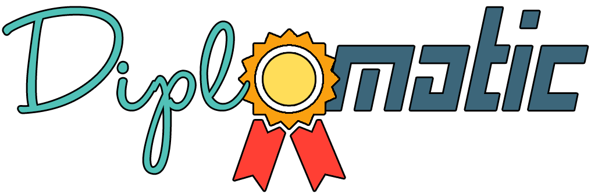

<p align="center">
	
</p>
<hr>

### *A cross-platform application for quickly creating and awarding diplomas* :black_nib: 

## Features
* :heavy_check_mark: Cool design
* :heavy_check_mark: Great developers :muscle:
* :x: [Vebjørn](https://github.com/vebjornhaugland) :heart_eyes:
* :x: Anything working at all

## Getting started
This project is based on the new .NET Standard (v2.0), which is a set of APIs that all .NET platforms have to implement, it is currently supported by the .NET Framework, .NET Core and Xamarin for .NET Core.

##### Requirements for running the project locally: 

* .NET Core 2.0 SDK
* Visual Studio 2017 v15.3+
* VS2017 Tools for Xamarin

#### Building Diplomatic

For building the project use the CAKE bootstrappers included in the project,
these scripts builds every project in the solution and runs the Unit tests.

For cleaning the project:
``` cmd
  $  .\build.ps1 -Target Clean
```

For building and running Unit Tests:
``` cmd
  $  .\build.ps1 
```


### Links
* [Diplomatic](https://github.com/Dualog-students/Diplomatic)
